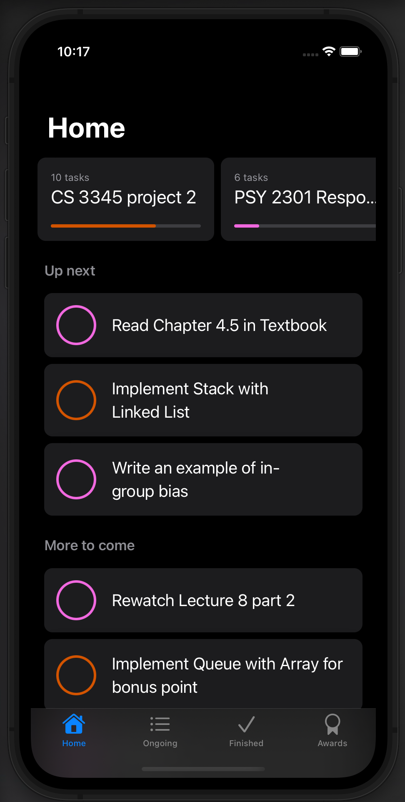

# ProjectManagement

This app allows you to manage all your projects, track your progress, and give you awards.

Technologies used in this app:
+ SwiftUI
+ CoreData

What I've learned:
+ Unit testing
+ UI testing
+ Create custom fetch request
+ Create static data for preview
+ Localization, translating my app to Vietnamese
+ Making my app accessible to everyone

